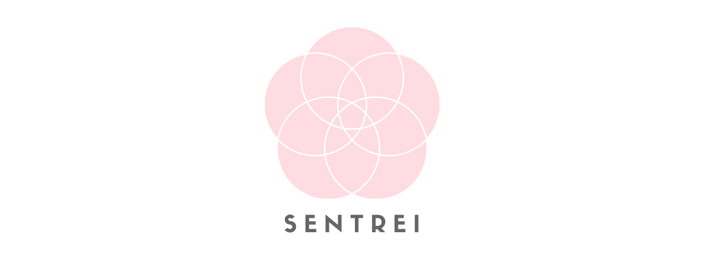

  

 

    
    <!-- <a></img></a>
    <a></img></a> -->

 

 

## Getting Started 🚀

### Company 🏢

<!-- prettier-ignore-start -->
| Project | Link | Package | Version |
| ------- | ---- | ------- | ------- |
| Pioneer | https://pioneer.sentrei.com | [`packages/pioneer`](packages/pioneer) |  |
| Sentrei | https://sentrei.com | [`sentrei`](package.json) |  |
<!-- prettier-ignore-end -->

### Packages 🧰

<!-- prettier-ignore-start -->
| Project | Package | Version |
| ------- | ------- | ------- |
| Common | [`packages/common`](packages/common) |  |
| Types | [`packages/types`](packages/@types) |  |
| UI | [`packages/ui`](packages/ui) |  |
| Video | [`packages/video`](packages/video) |  |
<!-- prettier-ignore-end -->

### Web 🌐

<!-- prettier-ignore-start -->
| Version | Web | Typedoc | Version |
| ------- | --- | ------- | ------- |
| alpha | https://alpha.sentrei.com | https://alpha.typedoc.sentrei.com |  |
| beta | https://beta.sentrei.com | https://beta.typedoc.sentrei.com |  |
| main | https://main.sentrei.com | https://main.typedoc.sentrei.com |  |
<!-- prettier-ignore-end -->

## Contributors ✨

Thanks goes to these wonderful people ([emoji key](https://allcontributors.org/docs/en/emoji-key)):

<!-- ALL-CONTRIBUTORS-LIST:START - Do not remove or modify this section -->
<!-- prettier-ignore-start -->
<!-- markdownlint-disable -->
<table>
  <tr>
    <td align="center"><a href="https://www.shunkakinoki.com/"> <b>Shun Kakinoki</b></a> <a href="https://github.com/sentrei/sentrei/commits?author=shunkakinoki" title="Code">💻</a> <a href="#projectManagement-shunkakinoki" title="Project Management">📆</a> <a href="#ideas-shunkakinoki" title="Ideas, Planning, & Feedback">🤔</a> <a href="#business-shunkakinoki" title="Business development">💼</a> <a href="#infra-shunkakinoki" title="Infrastructure (Hosting, Build-Tools, etc)">🚇</a></td>
    <td align="center"><a href="https://github.com/sentrei-bot"> <b>sentrei-bot</b></a> <a href="https://github.com/sentrei/sentrei/commits?author=sentrei-bot" title="Code">💻</a> <a href="#maintenance-sentrei-bot" title="Maintenance">🚧</a> <a href="#platform-sentrei-bot" title="Packaging/porting to new platform">📦</a></td>
    <td align="center"><a href="https://github.com/forestkoju"> <b>forestkoju</b></a> <a href="#a11y-forestkoju" title="Accessibility">️️️️♿️</a> <a href="#design-forestkoju" title="Design">🎨</a> <a href="#ideas-forestkoju" title="Ideas, Planning, & Feedback">🤔</a></td>
  </tr>
</table>

<!-- markdownlint-enable -->
<!-- prettier-ignore-end -->

<!-- ALL-CONTRIBUTORS-LIST:END -->

This project follows the [all-contributors](https://github.com/all-contributors/all-contributors) specification. Contributions of any kind welcome!

## License 📃

## Stargazers over time 📈

